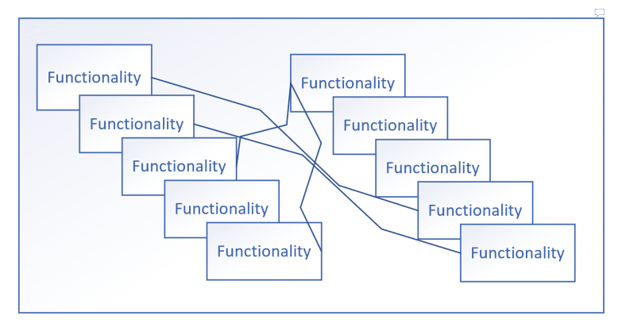
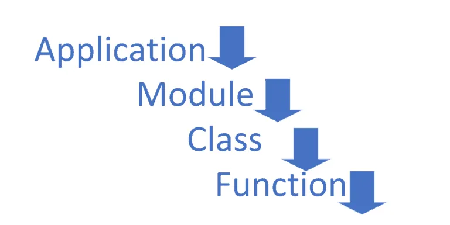

# UNIT TESTING BEST PRACTICES

## Why Unit Tests?

Your application/service consists of a bunch of functionalities built together to perform business operations. These small/large bunch of functionality together makes your application a complete in a sense.

It’s important these small individual functionalities are robust enough to make sure your application performs best in a real production environment.

How will you make sure these small pieces in your application will be robust??

There is no other better way than Unit Test. Unit Test is the `FIRST` things you should do to make your application robust. Tests are termed as unit tests because here the emphasis is on each individual piece of application.

## Where to start?

 

> ## All public functions within a class (created by you) require a unit test.

> So if you want to start somewhere in an existing application, then start with a small class and a simple method in the class.

Now we got an answer for where to start.

These best practices are generic enough to be applied to any approach of development you are using.

## Best Practices for Unit Testing

In an all to remember unit test cases should follow the `FIRST` principle:

## F = Fast

## I = Isolated

## R = Repeatable

## S = Self-checking

## T = Timely

### 1. Unit test cases should be Fast

Fast enough to execute in 10 ms. Yes in every test should run within milliseconds.

> Why? What it really meant to us? See below,

- That means you need to build your API as small as possible.
- If API existing already, refactor it immediately(pretty simple to say but go and get in buy-in for refactoring from your Manager)
- Small functions are easier to test and maintain
- Small functions promote read and reuse.
- Small functions help avoid hidden bugs that come with large functions. Large functions are sometimes impossible to test due to large dependencies and affect badly on code coverage.

So this best practice really has a broader meaning which drives all goodies to your code. Do Not Stop here …Here is what will make you think to design better API if you are following `Test Driven Development (TDD)` or even make you think redesign/refactor your existing legacy code.

### 2. Unit test cases should be Isolated

> Why? What it really meant? See below,

- Unit test cases are meant only for a given function and its business logic in a given class
- If that `API` (Let’s say `A`() )calls any other `API`( let’s say `B`())then you write separate unit tests for that dependency(i.e `B`()). That means you need to mock `B`() within `A`() to make isolation.
- Each unit test should be stateless and doesn’t depend on other unit tests by any means.

### 3. Unit test cases should be Repeatable

> Why? What it really meant? See below,

- This lot more depend on the second principle i.e Unit test cases are isolated.
- That’s means you get the same result for any number of times test cases are executed.
- That’s means you get the same result for any order in which test cases are executed as they are stateless in nature.
- That means you get the same result for all reason except when for breaking changes introduced by developers.
- Unit test cases find breaking changes right ahead of time.

### 4. Unit test cases should be Self-checking

> Why? What it really meant? See below,

- Already written unit test cases will be kept on checking for any breaking changes introduced by any developers.
- Right ahead of time intimation of a new bug introduced in the code by failing Unit test cases
- Self-checking will work on the local machine or could work on the build server as part of the CI-CD pipeline.

### 5. Unit test cases should be Timely

> Why? What it really meant? See below,

- A unit test should be written in a timely manner and should not take more time than the actual development of business functionality.
- Convinced? Here are the questions clarifying how much time should be spent on Unit test writing.

> If your unit test is taking more time to write,

1. That means you need to follow the first principle concept very seriously.
2. API is not small enough to test all scenarios easily.
3. Need to design/refactor your API.
4. That means you may pitch in hardly negotiating on Design with your manager and hence client..and lastly, do not stop here .. go get the buy-in.

Unit test cases have impact in the long run and do provide a lot of benefits on the maintenance side (shift left) for early identification of bugs and issues.

If working on existing code, unit test cases will give you a lot of early signals of coding issues and opportunities for improvements. It’s important to implements all those if possible.

Remember maintenance is a big fat elephant and always eats away most of the project budget in SDLC.

## Some additional best practices and guidelines for Unit Test cases

- Do not test private members/functions/methods.
- Test only public members. These public members can be used to test private members implicitly.
- Name your test appropriately
- Do not test auto-generated code-Example – Entity framework scaffolding, WSDL generated proxy class members, etc.
- Create stateless unit test cases.
- The order of execution of unit test cases is not important.
- Use code coverage tools for measuring code coverage.
- Mock everything which is a dependency
- Interface-based programming favors unit test cases. Always program by abstraction.
- Use Test-driven development with Test first approach.

## References

https://www.thecodebuzz.com/unit-testing-best-practices/
